# Proje Analizi: agentic-starter-kit

## Genel Bakış

**Amaç:** Yeni bir projeye başlarken AI coding agent'ları (Codex CLI, Claude Code vb.) için **context hygiene**, çalışma kuralları ve prompt şablonlarını tek komutla ([bootstrap.sh](file:///Users/ibrahim/projects/agentic-starter-kit/bootstrap.sh)) kuran bir başlangıç kiti.

**Dil/Teknoloji:** Tamamen Bash script tabanlı, framework-agnostik.

---

## Mimari Harita

```mermaid
graph TD
    A["bootstrap.sh"] --> B["templates/"]
    B --> B1["common/ — AGENTS.md, agentignore, prompt-template, config"]
    B --> B2["claude/ — CLAUDE.md, skills (bugfix-safe, review-pr-risk), plugin scaffold"]
    B --> B3["codex/ — config.toml"]
    
    S["scripts/"] --> S1["start-feature.sh — branch + plan kickoff"]
    S --> S2["new-task.sh — plan dosyası üretimi"]
    S --> S3["end-task.sh — verification + cost guard"]
    S --> S4["ready-review.sh — review payload üretimi"]
    S --> S5["package-pr.sh — PR paketi"]
    S --> S6["analyze-risk.sh — low/med/high risk"]
    S --> S7["context-cost-guard.sh — context koku tespiti"]
    S --> S8["migration-safety-gate.sh — migration güvenlik kapısı"]
    S --> S9["install-git-hooks.sh — post-commit + pre-push hook"]
    S --> S10["lib-config.sh — config okuma kütüphanesi"]
    
    D["docs/"] --> D1["operating-model.md"]
    D --> D2["quickstart-10min.md"]
    D --> D3["review-trigger.md"]
    D --> D4["skill-categories/ (6 kategori dokümanı)"]
```

---

## Bileşen Detayları

### 1. [bootstrap.sh](file:///Users/ibrahim/projects/agentic-starter-kit/bootstrap.sh) — Ana Kurulum Script'i
- Hedef proje path'i ve `--tool codex|claude|both` parametresi alır
- `templates/` klasöründen dosyaları hedef projeye kopyalar
- `--force` ile üstüne yazma desteği, varsayılan olarak mevcut dosyaları atlar

### 2. `templates/` — Şablonlar

| Şablon | Hedef | Açıklama |
|--------|-------|----------|
| [common/agentignore](file:///Users/ibrahim/projects/agentic-starter-kit/templates/common/agentignore) | `.agentignore` | `node_modules`, `vendor`, `.git`, build artifact'lerini ignore eder |
| [common/AGENTS.md](file:///Users/ibrahim/projects/agentic-starter-kit/templates/common/AGENTS.md) | [AGENTS.md](file:///Users/ibrahim/projects/agentic-starter-kit/templates/common/AGENTS.md) | Tüm agent'lar için context hijyeni kuralları |
| [common/prompt-template.txt](file:///Users/ibrahim/projects/agentic-starter-kit/templates/common/prompt-template.txt) | `docs/ai/prompt-template.txt` | Standart prompt yapısı (Goal / Scope / Constraints / Validation / Output) |
| [claude/CLAUDE.md](file:///Users/ibrahim/projects/agentic-starter-kit/templates/claude/CLAUDE.md) | [CLAUDE.md](file:///Users/ibrahim/projects/agentic-starter-kit/templates/claude/CLAUDE.md) | Claude Code'a özel çalışma kuralları |
| `claude/skills/bugfix-safe` | `.claude/skills/bugfix-safe/` | Güvenli bug-fix skill'i (scope → reproduce → plan → implement → validate) |
| `claude/skills/review-pr-risk` | `.claude/skills/review-pr-risk/` | Risk-first PR review skill'i |
| `claude/plugin/*` | `.claude-plugin/` | Plugin-ready scaffold (commands, hooks, skills + plugin.json) |
| `codex/config.toml` | `.codex/config.toml` | Codex CLI konfigürasyonu |

### 3. `scripts/` — Task Yaşam Döngüsü

Tam akış: **branch aç → plan yaz → implement → review → PR paketle → task kapat**

| Script | Görev |
|--------|-------|
| [start-feature.sh](file:///Users/ibrahim/projects/agentic-starter-kit/scripts/start-feature.sh) | Git branch + plan dosyası bootstrap (tek komutla) |
| [new-task.sh](file:///Users/ibrahim/projects/agentic-starter-kit/scripts/new-task.sh) | `docs/plans/YYYY-MM-DD-<slug>.md` plan dosyası oluşturur |
| [end-task.sh](file:///Users/ibrahim/projects/agentic-starter-kit/scripts/end-task.sh) | Verification checklist + context/cost guard + migration safety |
| [ready-review.sh](file:///Users/ibrahim/projects/agentic-starter-kit/scripts/ready-review.sh) | `docs/review-queue/` altında review payload üretir, duplicate SHA engeller |
| [package-pr.sh](file:///Users/ibrahim/projects/agentic-starter-kit/scripts/package-pr.sh) | `docs/pr-packages/` altında PR şablonu üretir |
| [analyze-risk.sh](file:///Users/ibrahim/projects/agentic-starter-kit/scripts/analyze-risk.sh) | Diff'e göre low/medium/high risk skoru hesaplar |
| [context-cost-guard.sh](file:///Users/ibrahim/projects/agentic-starter-kit/scripts/context-cost-guard.sh) | Context/cost "koku" kontrolü |
| [migration-safety-gate.sh](file:///Users/ibrahim/projects/agentic-starter-kit/scripts/migration-safety-gate.sh) | Migration/SQL değişikliklerinde onay kapısı |
| [install-git-hooks.sh](file:///Users/ibrahim/projects/agentic-starter-kit/scripts/install-git-hooks.sh) | `post-commit` (review prompt) + `pre-push` (migration gate) kurar |
| [lib-config.sh](file:///Users/ibrahim/projects/agentic-starter-kit/scripts/lib-config.sh) | [starter.config.yml](file:///Users/ibrahim/projects/agentic-starter-kit/starter.config.yml) dosyasından değer okuma kütüphanesi |

### 4. `docs/` — Dokümantasyon

- **operating-model.md:** Cursor + Codex CLI + Claude Code üçlüsünü çakıştırmadan yöneten çalışma modeli
- **quickstart-10min.md:** 10 dakikada bootstrap → feature → review → PR → close akışı
- **review-trigger.md:** Post-commit hook ile yarı otomatik review tetikleme akışı
- **skill-categories/:** 6 kategori halinde skill taksonomisi (Core Workflow, Debug, Code Review, Docs, Automation, Governance)

### 5. CI/CD
- [.github/workflows/scripts-check.yml](file:///Users/ibrahim/projects/agentic-starter-kit/.github/workflows/scripts-check.yml) — `bash -n` syntax check + `shellcheck` lint

---

## Risk Analiz Motoru

[analyze-risk.sh](file:///Users/ibrahim/projects/agentic-starter-kit/scripts/analyze-risk.sh) akıllı bir scoring sistemi kullanır:

| Kriter | Puan |
|--------|------|
| 25+ dosya değişikliği | +3 |
| 10-25 dosya | +2 |
| 5-10 dosya | +1 |
| Migration/SQL dosyaları | +3 |
| Auth/security/middleware/routes | +2 |
| Config/infra/docker/k8s/CI | +2 |
| Test dosyası varsa | -1 |

Eşikler [starter.config.yml](file:///Users/ibrahim/projects/agentic-starter-kit/starter.config.yml) ile yapılandırılabilir (default: ≥5 = high, ≥2 = medium).

---

## Güçlü Yanlar

1. **Framework-agnostik** — Laravel, Next.js, Django vb. herhangi bir proje ile kullanılabilir
2. **Tek komutla kurulum** — [bootstrap.sh](file:///Users/ibrahim/projects/agentic-starter-kit/bootstrap.sh) ile hızlı onboarding
3. **Tam task yaşam döngüsü** — Branch açmadan PR paketlemeye kadar script desteği
4. **Risk-aware review** — Otomatik risk skorlaması ve review payload'u
5. **Duplicate review koruması** — Aynı SHA için tekrar review üretimini engeller
6. **Git hook entegrasyonu** — Semi-automatic, spam olmayan review tetikleme
7. **İyi dokümante edilmiş** — Operating model, quickstart, skill taksonomisi
8. **`--yes` / `--ci` flag'leri** — CI/CD pipeline'larında non-interactive kullanım

## İyileştirme Önerileri

1. **Test eksikliği** — Bash script'ler için otomatik test yok (bats-core gibi bir framework eklenebilir)
2. **[starter.config.yml](file:///Users/ibrahim/projects/agentic-starter-kit/starter.config.yml) parser kapsamı** — `lib-config.sh` lightweight/best-effort bir okuyucu; kompleks/nested YAML kullanımında sınırlı. Ya parser genişletilmeli ya da flat key standardı dokümante edilmeli.
3. **[starter.config.yml](file:///Users/ibrahim/projects/agentic-starter-kit/starter.config.yml) şablonu** — Validation komutları placeholder olarak bırakılmış; proje tipine göre (Laravel, Node, Python) hazır preset'ler eklenebilir
4. **Codex config.toml şablonu minimal** — İçeriği zenginleştirilebilir
5. **Plugin scaffold README'leri** — Hook ve skill README'leri placeholder; gerçek örneklerle doldurulabilir
6. **Versiyonlama** — `CHANGELOG.md` ve semantic versioning eklenebilir
7. **Uninstall/rollback** — Bootstrap'ı geri alan bir `teardown.sh` script'i eklenebilir
8. **Interaktif hook davranışı** — Hooklar yarı otomatik/interaktif tasarlandığı için CI/non-interactive akışlarda `--ci` kullanımının net şekilde standartlaştırılması faydalı olur

---

## Sonuç

Bu proje, AI-assisted development süreçlerini **disiplinli ve tekrarlanabilir** hale getirmek için iyi düşünülmüş bir starter kit. Özellikle context hijyeni, risk-first review ve semi-automatic task akışı yaklaşımları endüstri best practice'leriyle uyumlu. Script altyapısı sağlam (`set -euo pipefail`, config kütüphanesi, duplicate koruması), dokümantasyon kapsamlı. En büyük eksik, bash script'ler için otomatik test coverage.
